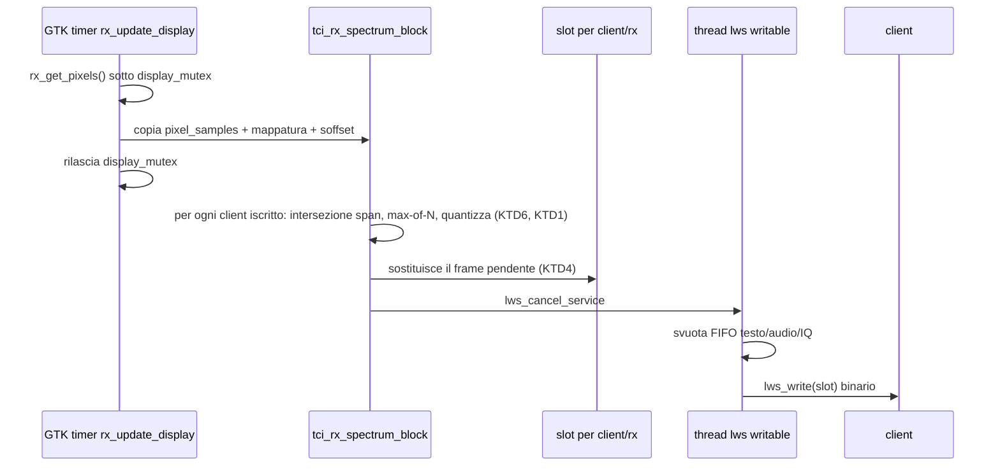
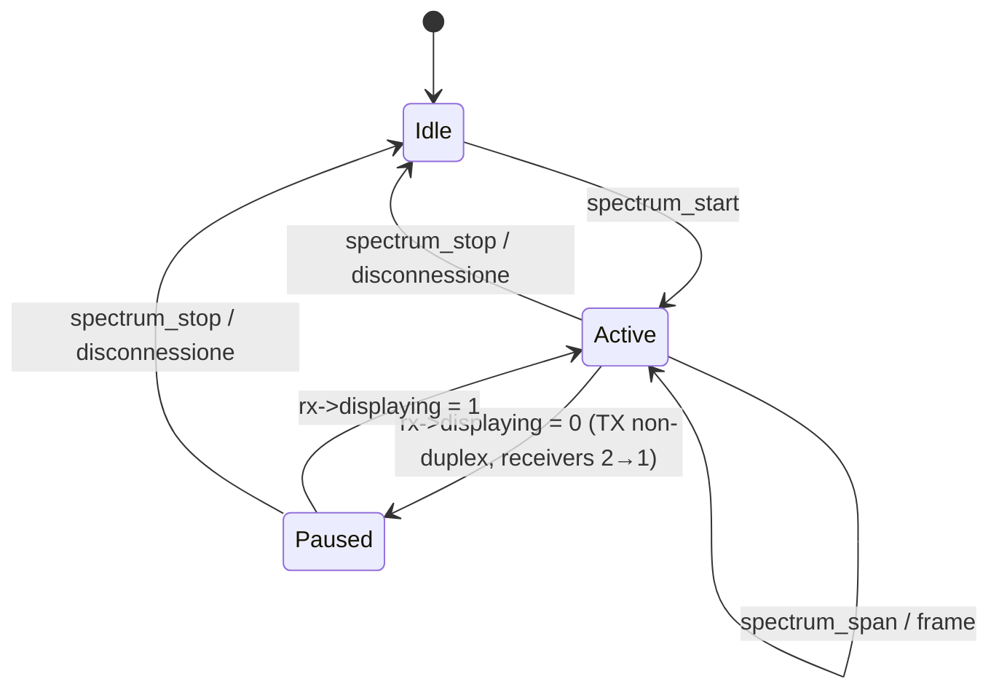
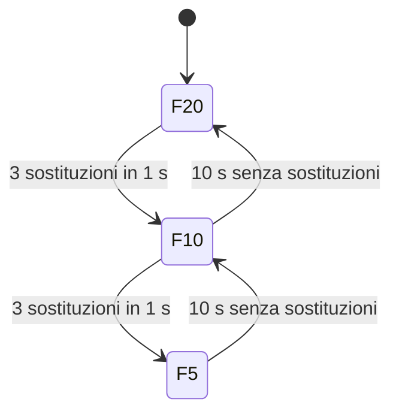

# TCI Remote Extensions - Plan

## Goal Capsule

- **Objective:** un operatore remoto, su WAN con perdita e dentro WireGuard, vede in un browser lo spettro della radio HPSDR pilotata da deskHPSDR con banda inferiore a 50 kbit/s, cambia banda e attenuazione dal client TCI, e nessun client TCI esistente (Thetis, ExpertSDR-like, TOTW stock) cambia comportamento.
- **Means:** estensioni TCI opt-in per client nel server libwebsockets di deskHPSDR: frame binario spettro a bin quantizzati con negoziazione e fps adattivo, due comandi CAT-like, permessage-deflate, bind address configurabile (KTD1, KTD2, KTD3, KTD7, KTD8, KTD9, KTD10).
- **Authority hierarchy:** il documento dei requisiti in `origin` decide il prodotto (R-ID); questo piano decide il meccanismo (KTD); l'implementatore decide i nomi delle funzioni e i dettagli locali entro le unità.
- **Stop conditions:** fermarsi e chiedere se una modifica richiesta cambia il comportamento del server TCI per un client che non ha negoziato l'estensione (R1), se il formato frame di KTD1 deve cambiare dopo che TOTW lo ha adottato, o se il produttore spettro aumenta il carico del ciclo di display oltre il 10 % misurato con `display_debug`.
- **Execution profile:** un fork personale, un branch, unità in ordine di dipendenza; ogni unità compilabile e verificabile da sola; rebuild completo dopo ogni modifica a un header (il Makefile non traccia le dipendenze dagli header).
- **Tail ownership:** verifica su banco con la radio ANAN dell'operatore (schede Orion/Angelia: due ADC, attenuatore a step, nessun gain RX) e simulazione WAN spettano all'operatore (Simo); i test dell'harness C e la sonda Python spettano all'implementatore. Le radio a un solo ADC con gain (Hermes-Lite 2) non sono sul banco: quel ramo si verifica solo per lettura del codice.

---

## Product Contract

### Summary

Il piano aggiunge al server TCI di deskHPSDR uno stream spettro a bin (`type=4`) prodotto dal ciclo di display esistente, negoziato per client con `spectrum_start`, ritagliato in software con `spectrum_span`, regolato in fps sul backlog del client; due comandi CAT-like (`rx_att_ex`, `band_ex`); permessage-deflate via ricompilazione di libwebsockets; bind address per TCI e rigctl. Le parti pure (mappatura, decimazione, quantizzazione, serializzazione) vivono in un modulo C separato con harness standalone. Audio Opus in TCI, il client TOTW e il tool CW restano fuori e usano il formato frame congelato qui come contratto.

### Problem Frame

deskHPSDR espone via TCI solo lo stream IQ float32 al sample rate del SDR (≥ 3 Mbit/s a 48 k), inutilizzabile su 4G/5G con perdita; non espone attenuatore né cambio banda; ascolta su tutte le interfacce. Il client browser TOTW disegna da un array di 4096 bin e può accettare bin già calcolati. DL1BZ non accetta estensioni sperimentali nel core, quindi tutto vive in un fork e deve essere invisibile ai client che non lo negoziano (vedi origin: `docs/brainstorms/2026-09-08-remote-station-requirements.md`, sezioni 1-3).

### Requirements

**Compatibilità**

- R1. Nessuna modifica al comportamento del server TCI per un client che non negozia un'estensione: nessun frame, evento o messaggio nuovo verso di lui, nessun effetto sul panadapter locale, nessun costo CPU misurabile quando nessuno è iscritto. (SRV-01)

**Stream spettro**

- R2. Frame binario `type=4` con sorgente `rx->pixel_samples` dopo `GetPixels()`, senza FFT aggiuntiva, header TCI da 64 byte invariato nel layout, payload con span in Hz, floor e scala in dB, bin uint8 a passo 0,5 dB. I valori dB includono la correzione di attenuazione e preamp del panadapter locale. (SRV-02)
- R3. Negoziazione `spectrum_start:<rx>,<bins>,<fps>;` e `spectrum_stop:<rx>;` con default 512 bin e 10 fps; decimazione max-of-N, mai media. La risposta riporta i valori effettivi. (SRV-03)
- R4. fps adattivo: quando il client accumula ritardo il server scende 20→10→5 fps; un frame spettro in ritardo viene sostituito, mai accodato dietro il precedente. (SRV-04)
- R5. `spectrum_span:<rx>,<low>,<high>;` limita i bin allo span richiesto; il server invia un solo array per span; il frame riporta lo span effettivo. Lo span non modifica zoom e pan della GUI locale. (SRV-05)
- R9. Quando il receiver smette di aggiornare il display (TX non-duplex, rimozione del secondo receiver) il client iscritto riceve `spectrum_state:<rx>,0;`, l'iscrizione resta, e riceve `spectrum_state:<rx>,1;` alla ripresa. Nessun frame nel frattempo.
- R10. L'fps negoziato è limitato all'fps del display locale del receiver; il valore effettivo è riportato al client.

**Trasporto**

- R6. permessage-deflate disponibile nel server; attivo solo per i client che lo negoziano nell'handshake WebSocket (i browser lo negoziano di default, i client nativi no). Una build con libwebsockets senza extension compila e gira senza deflate, con un messaggio a log. (SRV-06)

**Comandi CAT-like**

- R7. `rx_att_ex:<rx>[,<value>];` legge o imposta attenuazione o gain RF dell'ADC a cui è collegato il receiver indicato, dichiarando nella risposta il tipo (`att`, `gain`, `none`), il range e l'indice ADC; su radio a un solo ADC il valore vale per entrambi i receiver. `band_ex:<rx>,<title>[,next];` cambia banda tramite band-stack sul VFO del receiver indicato; stessa banda senza `next` è un no-op; `next` avanza il band-stack. (SRV-07)

**Rete**

- R8. Porta TCI 40001 e server rigctl TCP TS-2000 possono essere legati a un indirizzo configurato nel file props; default invariato (tutte le interfacce). (SRV-10)

### Key Decisions

- **Solo il lato server nel fork deskHPSDR** — TOTW e tool CW hanno piani propri. Governs R1-R10.
- **Audio fase 1 = Mumble su PipeWire** (DEC-01 = A nell'origin) — SRV-08 escluso. Governs Scope Boundaries.
- **`spectrum_span` è ritaglio software** (session-settled: user-approved — scelto rispetto a pilotare zoom e pan locali: la risoluzione resta quella del panadapter locale ma la GUI dell'operatore non cambia e non si introduce nesting di mutex). Governs R5.
- **Evento di stato durante il TX non-duplex** (session-settled: user-approved — scelto rispetto a reinviare l'ultimo frame: su WAN il client deve distinguere TX da link caduto). Governs R9.
- **`rx_att_ex` è passthrough tipizzato** (session-settled: user-approved — scelto rispetto a una scala unificata 0-99 come rigctl `RA`: HL2 ha solo gain −12…+48 dB, la scala unificata perde informazione). Governs R7.
- **Deflate in perimetro con ricompilazione di libwebsockets** (session-settled: user-approved — scelto rispetto a rimandarlo: ~40 kbit/s non compressi sarebbero già accettabili ma la ricompilazione è un solo script). Governs R6.
- **Product Contract preservation:** changed: R9, R10 aggiunte — l'analisi dei flussi ha trovato che il timer di display viene distrutto durante il TX non-duplex e che l'fps del display limita la cadenza; l'origin non copriva i due casi. R1-R8 invariati nel significato.

### Scope Boundaries

- Fuori perimetro: SRV-08 (Opus in TCI), CLI-*, CW-*, N1M-*, AUD-* dell'origin.
- Fuori perimetro: spettro del transmitter (`PS_RX_FEEDBACK`) e spettro TX.
- Fuori perimetro: zoom o pan remoti che cambino la GUI locale.

#### Deferred to Follow-Up Work

- Listener UDP RX200 e LPF di `src/rigctl.c` (`INADDR_ANY`): non toccati da R8; da valutare in un piano di hardening rete.
- Notifica broadcast di `rx_att_ex` e `band_ex` agli altri client estesi: oggi solo il richiedente riceve la risposta; gli altri vedono l'effetto nei frame spettro e in `vfo:`.
- Estensione di `set_attenuation_value()` in `src/sliders.c` con parametro receiver, allineandola a `set_rf_gain()`: il piano imposta l'ADC direttamente per receiver non attivi (KTD7), il refactor dello slider è rinviato.
- Voce nel menu CAT/TCI per il bind address: il piano usa solo il file props.
- Un frame "delta" per span persistente (CLI-04 dell'origin): il client interpola, il server non invia delta in questa fase.

### Acceptance Examples

- AE1. **Covers R1.** Given un client Thetis connesso senza inviare comandi `spectrum_*`, When un secondo client invia `spectrum_start:0,512,10;`, Then il primo client non riceve alcun frame `type=4` né messaggi `spectrum_*`, e l'audio e l'IQ del primo client restano invariati.
- AE2. **Covers R3, R10.** Given display locale a 10 fps, When il client invia `spectrum_start:0,512,20;`, Then la risposta è `spectrum_start:0,512,10;` e i frame arrivano a ≤ 10 al secondo.
- AE3. **Covers R5.** Given sample rate 192 kHz centrato a 14,100 MHz, When il client invia `spectrum_span:0,14000000,14350000;`, Then la risposta riporta lo span ottenuto `14004000…14196000` (ritagliato ai limiti disponibili, arrotondato ai pixel) e i frame successivi coprono quello span.
- AE4. **Covers R9.** Given radio non-duplex con client iscritto, When l'operatore va in TX, Then il client riceve `spectrum_state:0,0;` e nessun frame; When torna in RX, Then riceve `spectrum_state:0,1;` e i frame riprendono senza reinviare `spectrum_start`.
- AE5. **Covers R7.** Given una ANAN con schede Orion/Angelia (due ADC, attenuatore), When il client invia `rx_att_ex:0;`, Then la risposta è `rx_att_ex:0,att,<valore>,0,31,1,0;`. When invia `rx_att_ex:0,12;`, Then l'attenuatore dell'ADC 0 vale 12 dB, il receiver 1 sull'ADC 1 non cambia, e la risposta riporta il nuovo valore. Su una radio a un solo ADC (Hermes-Lite 2, tipo `gain`) lo stesso comando vale per entrambi i receiver: caso verificato per lettura del codice, non sul banco.
- AE6. **Covers R7.** Given VFO A su 20 m, When il client invia `band_ex:0,20;`, Then la frequenza non cambia e la risposta è `band_ex:0,20;`. When invia `band_ex:0,20,next;`, Then il VFO passa alla voce successiva del band-stack dei 20 m.
- AE7. **Covers R4.** Given un link con RTT 60 ms, 2 % di perdita e banda limitata a 32 kbit/s, sotto i ~40 kbit/s dello spettro a 512 bin e 10 fps, When il socket si satura e lo slot sostituisce 3 frame in un secondo, Then il server emette `spectrum_fps:0,5;` e scende a 5 fps; dopo 10 s senza sostituzioni risale di un gradino e lo comunica.

---

## Planning Contract

### Key Technical Decisions

- KTD1. **Formato frame `type=4` (DEC-02 congelato).** Header `TCI_STREAM_HEADER` invariato: `receiver` = indice `receiver[]`, `sample_rate` = sample rate del receiver, `format` = 4 (nuova costante "u8 quantizzato"), `codec` = 0, `crc` = 0, `length` = numero di bin, `type` = 4, `channels` = 1, `reserv` = 0. Payload little-endian con prefisso fisso di 32 byte poi `length` byte di bin. Frequenze in `int64` Hz assoluti, perché float32 ha ULP di 16 Hz a 144 MHz e il client non può derivare il centro dello spettro dai messaggi `vfo:` (che in CTUN riportano `ctun_frequency`). Valore ricostruito dal client: `dbm = floor_db + q * scale_db`; `q = 255` vale saturazione. Il numero 4 per `type` resta quello dell'origin: la spec ExpertSDR definisce solo 0-3; se upstream lo assegna in futuro il client TOTW lo rimappa in un solo punto.

  | Offset payload | Tipo | Campo | Note |
  |---|---|---|---|
  | 0 | uint16 | `version` | 1 |
  | 2 | uint16 | `flags` | bit0 = span ritagliato ai limiti, bit1 = span completo |
  | 4 | uint32 | `seq` | contatore per client e receiver, riparte da 0 a ogni `spectrum_start` |
  | 8 | int64 | `low_hz` | frequenza del bordo sinistro del bin 0 |
  | 16 | int64 | `high_hz` | frequenza del bordo destro dell'ultimo bin |
  | 24 | float32 | `floor_db` | minimo del frame arrotondato a 0,5 dB |
  | 28 | float32 | `scale_db` | 0,5 |
  | 32 | uint8[length] | `bins` | `q = clamp(round((v − floor) / scale), 0, 255)` |

- KTD2. **Un solo proprietario della mappatura pixel→Hz.** Una funzione in `src/rx_panadapter.c` (o `src/receiver.c`) restituisce la frequenza del pixel 0 e `hz_per_pixel` con la stessa convenzione del disegno locale: centro `vfo[id].frequency` spostato di `∓ cw_keyer_sidetone_frequency` in CWU/CWL e dell'offset DC di modo (`rx_get_mode_dc_offset()`, 500 Hz in AM/SAM), meno metà sample rate. Il panadapter locale e il produttore spettro la usano entrambi, così bin e traccia locale coincidono.
- KTD3. **Produttore agganciato al ciclo di display, copia sotto lock, elaborazione fuori.** In `rx_update_display()` dopo `rx_get_pixels()` con `rc != 0`, dentro `display_mutex`, il produttore copia `pixel_samples`, `pixels`, la mappatura di KTD2 e l'offset dB (`soffset`) in un buffer privato per receiver e rilascia il lock. Poi, sotto `tci_mutex` con snapshot dei client, decima e accoda per ogni client iscritto. Nessun nesting `display_mutex` → `tci_mutex`. Un contatore atomico globale di iscritti fa uscire subito quando vale zero (R1), come `tci_iq_stream_clients` per l'IQ.
- KTD4. **Slot coalescente per client e receiver, fuori dalla FIFO.** La coda `lws_tx_queue` resta per testo, audio e IQ. Lo spettro usa uno slot per client e receiver: un frame nuovo sostituisce quello pendente e incrementa un contatore di frame sostituiti. Il callback writable scrive un solo elemento per invocazione, come oggi: la testa della FIFO se non è vuota, altrimenti lo slot pendente; si ri-arma con `lws_callback_on_writable()` se FIFO o slot restano pieni, e il loop di `tci_lws_server()` arma il writable anche quando solo lo slot è pieno. Lo slot non incrementa `idle_queued`, che è saturato dall'audio (≈ 94 frame/s per receiver contro un cap di 100) e non misurerebbe lo spettro.
- KTD5. **fps effettivo e scala adattiva.** `fps_eff = min(fps_richiesto, rx->fps)` arrotondato a una divisione intera del timer di display; il produttore invia un frame ogni `rx->fps / fps_eff` aggiornamenti. Scala 20→10→5 con soglia: 3 sostituzioni nello slot in una finestra di 1 s scendono di un gradino; 10 s senza sostituzioni risalgono di un gradino fino al richiesto. Il trigger è la saturazione del socket (scrittura lws non completata entro un periodo del produttore), non RTT o perdita. Ogni cambio emette `spectrum_fps:<rx>,<fps>;` al solo client interessato.
- KTD6. **Ritaglio span in software.** Il server tiene per client e receiver `[low, high]` richiesti; a ogni frame li interseca con lo span disponibile, li converte in indici pixel con KTD2, decima max-of-N in `K = min(bins, pixel_selezionati)` gruppi contigui, e scrive lo span reale nel frame. `spectrum_span:<rx>,0,0;` torna allo span completo. Nessuna chiamata a `set_zoom()` o `set_pan()`.
- KTD7. **`rx_att_ex` tipizzato e per ADC.** Attenuazione e gain sono proprietà dell'ADC (`adc[].attenuation`, `adc[].gain`), non del receiver: il server risolve `adc_id = receiver[rx]->adc`, applica su `adc[adc_id]` e riporta l'indice nella risposta `rx_att_ex:<rx>,<tipo>,<valore>,<min>,<max>,<passo>,<adc>;`. Su HL2, Hermes e ANAN-10/100 `n_adc = 1` e i due receiver condividono l'ADC 0; solo i modelli a due ADC (ANAN-100D/200D/7000/8000/G2) hanno valori indipendenti. Se `have_rx_att`: tipo `att`, range 0…31 passo 1. Se `have_rx_gain`: tipo `gain`, range da `adc[].min_gain`/`max_gain`. Altrimenti tipo `none`. Applicazione in un callback `g_idle_add` sul modello di `ext_set_af_gain()` in `src/ext.c`: scrivere direttamente `adc[receiver[rx]->adc].attenuation` (o `.gain`) e chiamare `schedule_high_priority()`; aggiornare lo slider solo se `display_sliders` è attivo e l'ADC coincide con quello del receiver attivo. Nessuna chiamata a `set_attenuation_value()` o `set_rf_gain()`: con gli slider nascosti entrambe aprono `show_popup_slider()` sulla GUI locale. Set-lock per parametro con un nuovo id, come gli altri parametri condivisi.
- KTD8. **`band_ex` per titolo.** Argomento = `BAND.title` (es. `20`, `40`, `160`, `GEN`), stabile fra regioni a differenza dell'indice enum. `<rx>` → VFO come in `tci_set_vfo()` (0 = VFO A, 1 = VFO B), rifiutato se `>= receivers`. Prima di chiamare `vfo_band_changed()` il server verifica che la frequenza della voce di band-stack destinazione sia dentro i limiti della radio, per evitare l'applicazione parziale che `vfo_band_changed()` fa prima di rinunciare. Stessa banda senza `next` → risposta senza effetto; `next` → `vfo_band_changed()` con la banda corrente, che avanza il band-stack. Esecuzione in un callback `g_idle_add` che racchiude `vfo_band_changed()` tra `tci_begin_apply()` e `tci_end_apply()`: il flag è sincrono, quindi la coppia sta dentro il callback, non attorno a `g_idle_add`. Poiché `vfo_vfos_changed()` non notifica TCI mentre il flag è attivo, dopo `tci_end_apply()` il callback chiama esplicitamente `tci_vfos_changed()`, come `tci_set_vfo()` fa con i suoi broadcast.
- KTD9. **permessage-deflate con guardia di compilazione.** `build-libwebsockets.sh` aggiunge `-DLWS_WITHOUT_EXTENSIONS=OFF -DLWS_WITH_ZLIB=ON`. In `tci_lws_server()` un array `lws_extension` con `lws_extension_callback_pm_deflate` e parametri `permessage-deflate; client_no_context_takeover; client_max_window_bits` va in `info.extensions`, dentro `#if !defined(LWS_WITHOUT_EXTENSIONS)`; l'altro ramo stampa a log che deflate non è disponibile. Il Makefile già preferisce la build locale quando presente, anche su macOS, e nel ramo della lws locale aggiunge `-lz`. Nessun codice per client: la negoziazione avviene nell'handshake. I client browser (TOTW stock incluso) offrono deflate di default e lo ottengono su tutti i frame, audio e IQ compresi; Thetis e i client Qt non la offrono e restano invariati. R1 vale quindi per intero sui client nativi; per i browser la sola differenza è la compressione negoziata, misurata dal gate di regressione.
- KTD10. **Bind address da props.** Due stringhe `tci_bind_addr` e `rigctl_bind_addr` lette e scritte in `src/radio.c` accanto a `tci_port` e `rigctl_port_base`; vuote = comportamento attuale. lws: `info.iface`. rigctl TCP: `inet_pton` sull'indirizzo; se l'indirizzo è impostato ma non parsabile, log e listener non avviato (fail-closed), come per un indirizzo valido ma non assegnato: il bind address è l'unico controllo d'accesso su un server senza autenticazione e non deve fallire in apertura.
- KTD11. **Modulo puro testabile.** `src/tci_spectrum.c` e `src/tci_spectrum.h` contengono solo funzioni senza dipendenze da GTK, WDSP o lws: intersezione span, conversione Hz→indici, decimazione max-of-N, quantizzazione, serializzazione del prefisso. Un harness `tests/tci_spectrum_test.c` con un target Makefile dedicato le esercita con vettori noti. Il resto del server TCI resta fuori dal perimetro di test automatico.
- KTD12. **Sonda Python come strumento di verifica.** `stuff/tci_spectrum_probe.py`, script standalone con header uv e dipendenza `websockets`: si connette, negozia, misura fps e banda, stampa span e floor, ed espone sottocomandi per `rx_att_ex` e `band_ex`. È lo strumento con cui si verificano AE2-AE7 sul banco.

### High-Level Technical Design

Percorso di un frame spettro, dal timer di display al socket:

Ciclo di vita dell'iscrizione per client e receiver:

Scala fps adattiva (KTD5):

I gradini superiori al richiesto o all'fps del display non esistono per quel client.

### Sequencing

U1 → U2 → U3 → U4. U5 dipende solo da U1 per le convenzioni di risposta e procede in parallelo a U2-U4. U6 e U7 non hanno dipendenze e procedono da subito, in parallelo a U1-U4. U8 dipende da U3 e U5; U4 non è un prerequisito di U8.

### Deferred Implementation Notes

- Nome e posizione esatta della funzione di mappatura di KTD2 (se in `rx_panadapter.c` o `receiver.c`) si decidono leggendo quanto codice del panadapter va condiviso.
- L'esatto arrotondamento di `fps_eff` a un divisore intero di `rx->fps` (es. 30 fps locale con 20 richiesti → 15 o 10) si decide misurando la fluidità in TOTW.
- Se `lws_send_pipe_choked()` aggiunge informazione utile alla scala di KTD5 si valuta dopo il test WAN; il piano usa solo il contatore di sostituzioni.
- La stringa dei parametri deflate può richiedere tuning con lws 5.0 (`server_max_window_bits`); si verifica con la sonda che l'handshake includa l'extension.

---

## Implementation Units

### U1. Modulo puro spettro e contratto binario

- **Goal:** congelare KTD1 in codice: costanti, struct del prefisso, funzioni pure di intersezione span, conversione Hz→indici, decimazione max-of-N, quantizzazione, serializzazione; harness di test.
- **Requirements:** R2, R3, R5.
- **Dependencies:** nessuna.
- **Files:** `src/tci_spectrum.h`, `src/tci_spectrum.c` (nuovi); `src/tci_audio.h` e `src/tci.c` (includono `tci_spectrum.h`); `tests/tci_spectrum_test.c` (nuovo); `Makefile` (target di test e nuovo oggetto).
- **Approach:**
  1. `src/tci_spectrum.h` include solo `stdint.h` e `stddef.h` e definisce le costanti `TCI_STREAM_SPECTRUM` (type 4) e `TCI_SPECTRUM_FORMAT_U8` (format 4) più il typedef del prefisso; `tci_audio.h` e `tci.c` lo includono, mai il contrario, perché `tci_audio.h` tira glib e l'harness deve compilare con il solo `cc`.
  2. Definire il prefisso come struct con campi nell'ordine di KTD1 e una funzione che lo scrive in un buffer little-endian esplicitamente (memcpy per campo, non cast di struct: il codice gira anche su ARM). L'header da 64 byte è serializzato per offset noti, senza usare il typedef `TCI_STREAM_HEADER`.
  2. Funzione di intersezione: dati span disponibile e richiesto restituisce indici `[i0, i1)` e flag ritaglio.
  3. Decimazione: `K = min(bins, i1 − i0)`, gruppi contigui con confini calcolati in interi (`i0 + g*(i1−i0)/K`), massimo per gruppo.
  4. Quantizzazione: floor = minimo arrotondato per difetto a 0,5, `q` con clamp.
  5. Harness: eseguibile standalone compilato con `cc` e il solo modulo, senza GTK.
- **Patterns to follow:** stile e naming di `src/tci_audio.c` (prefisso `tci_`, funzioni statiche), ma tipi standard (`unsigned`, `size_t`, `uint8_t`) al posto di `guint`; i valori delle costanti proseguono la serie `TCI_STREAM_*` di `src/tci_audio.h`.
- **Test scenarios:**
  - Intersezione con span richiesto interno → indici corretti, flag ritaglio 0.
  - Span richiesto che sborda a sinistra e a destra → indici clampati, flag ritaglio 1, span effettivo restituito.
  - Span richiesto disgiunto da quello disponibile → nessun bin, il chiamante non emette il frame.
  - Decimazione di 1000 pixel in 512 bin: ogni bin è il massimo del suo gruppo, i gruppi coprono tutti i pixel senza buchi né sovrapposizioni.
  - Richiesti 4096 bin su 1000 pixel → `K = 1000`, nessuna interpolazione.
  - Richiesti 0, −5 o 100000 bin → il clamp li porta in [16, 4096] prima della decimazione; nessuna divisione per zero.
  - Quantizzazione: valore uguale al floor → 0; floor + 127,5 dB → 255; valore oltre → 255; valore sotto il floor per arrotondamento → 0.
  - Serializzazione: buffer atteso byte per byte per un frame con 4 bin noti, verificato anche il `length` nell'header.
- **Verification:** l'harness compila ed esce 0; il target Makefile è documentato nel piano di verifica.

### U2. Mappatura pixel-Hz condivisa e produttore nel ciclo di display

- **Goal:** una sola funzione per la frequenza del pixel 0 (KTD2), usata dal panadapter e dal nuovo hook `tci_rx_spectrum_block()`; hook di stato quando `rx->displaying` cambia.
- **Requirements:** R1, R2, R9.
- **Dependencies:** U1.
- **Files:** `src/rx_panadapter.c`, `src/rx_panadapter.h` o `src/receiver.c`, `src/receiver.h`; `src/receiver.c` (`rx_update_display`, `rx_set_displaying`); `src/tci.c`, `src/tci.h` (hook e buffer per receiver).
- **Approach:**
  1. Estrarre dal disegno del panadapter il calcolo di `min_display` a `pan = 0`, di `pan_display_shift` (offset DC di modo) e di `soffset` in una funzione riutilizzabile; il panadapter la chiama al posto del codice inline.
  2. In `rx_update_display()` dopo `rx_get_pixels()` con `rc != 0`, dentro `display_mutex`, chiamare l'hook che copia in un buffer per receiver (riallocato se `pixels` cambia) e rilascia.
  3. L'hook esce immediatamente se il contatore atomico di iscritti vale zero.
  4. In `rx_set_displaying()` chiamare `tci_rx_displaying_changed(rx)`; l'hook ricorda per receiver l'ultimo stato notificato ed emette `spectrum_state` ai client iscritti solo sulla transizione (U3 lo consuma), perché `rx_set_displaying()` è richiamata anche a stato invariato (cambio fps locale, creazione del receiver). Lo stesso evento di cambio fps ricalcola `fps_eff` (KTD5) ed emette `spectrum_fps` se cambia.
  5. Mantenere il lavoro sotto `display_mutex` a una `memcpy` più pochi scalari.
- **Execution note:** attivare `display_debug` prima e dopo per confrontare `avg` e `load` del ciclo di display a 2 receiver con un client iscritto: la differenza deve restare sotto il 10 %.
- **Patterns to follow:** `tci_rx_iq_block()` in `src/tci.c` per il pattern "snapshot dei client fuori dal lock"; `tci_iq_stream_clients` per il contatore atomico.
- **Test scenarios:**
  - Nessun client iscritto → l'hook ritorna senza toccare il buffer né `tci_mutex` (misurabile con `display_debug`: nessuna variazione).
  - Client iscritto con zoom 1 → `low_hz` e `high_hz` del frame coincidono con i bordi del panadapter locale a `pan = 0`.
  - Modo CWU con sidetone 700 Hz → la mappatura è spostata di −700 Hz come la traccia locale.
  - Cambio zoom locale 1→4 → il frame successivo ha `pixels` nuovi e span invariato, nessun crash da realloc (il buffer privato si adatta).
  - Cambio sample rate 48 k→192 k → span del frame quadruplicato, nessun frame con dimensioni incoerenti.
  - `displaying` 1→0→1 → due eventi `spectrum_state` nell'ordine giusto.
  - Cambio fps locale con `displaying` = 1 → nessun `spectrum_state` emesso.
  - Modo AM → mappatura spostata di 500 Hz come la traccia locale.
- **Verification:** la traccia locale non cambia (confronto visivo prima/dopo); un log di debug mostra copia e rilascio nell'ordine atteso.

### U3. Comandi spectrum, stato per client, slot coalescente

- **Goal:** `spectrum_start`, `spectrum_stop`, `spectrum_span` con risposte, stato per client e receiver, slot coalescente nel percorso di scrittura, eventi `spectrum_state`, pulizia alla disconnessione.
- **Requirements:** R1, R3, R5, R9, R10.
- **Dependencies:** U1, U2.
- **Files:** `src/tci.c` (struct `CLIENT`, init, dispatch table, handler, `tci_lws_write_queued`, loop di `tci_lws_server`, cleanup), `src/tci_spectrum.h`.
- **Approach:**
  1. Aggiungere a `CLIENT` per receiver: iscritto, bin richiesti, fps richiesto ed effettivo, span richiesto, `seq`, slot pendente (buffer e lunghezza), contatore sostituzioni, timestamp finestra.
  2. Handler `spectrum_start` valida `rx < receivers` e `< TCI_RX_AUDIO_MAX_RECEIVERS`, applica default 512/10, clampa `bins` in [16, 4096] con `tci_clamp_int()` (4096 = array del client TOTW) e fps a `rx->fps` (R10), azzera `seq`, incrementa il contatore atomico, risponde con i valori effettivi tramite `tci_cmd_name()`. Lo slot per client e receiver è allocato sul numero di bin emesso `K`, mai sul valore richiesto.
  3. Handler `spectrum_stop` azzera lo stato, libera lo slot, decrementa il contatore.
  4. Handler `spectrum_span` valida `low < high`, salva, risponde con lo span effettivo dell'ultimo frame o "pending" se non c'è ancora un frame.
  5. Forma senza argomenti = query dello stato corrente.
  6. In `tci_lws_write_queued()`: un solo elemento per invocazione, la testa della FIFO se presente, altrimenti lo slot pendente; ri-armare il writable se FIFO o slot restano pieni. Nel loop di `tci_lws_server()` (blocco `tci_lws_pending_writable`) armare il writable anche quando solo lo slot è pieno; il produttore chiama `lws_cancel_service()` come fanno le altre code.
  7. Cleanup alla disconnessione: liberare gli slot, decrementare il contatore per ogni iscrizione attiva.
  8. Gate opzionale: nessun `spectrum_enable`, l'iscrizione è la negoziazione; nessun messaggio `spectrum_*` verso client non iscritti.
- **Patterns to follow:** `tci_cmd_iq_start()`/`tci_cmd_iq_stop()` per validazione e mutex; `tci_cmd_rtty_enable()` per la forma query; cleanup in `LWS_CALLBACK_CLOSED`.
- **Test scenarios:**
  - **Covers AE1.** Due client, uno iscritto: il non iscritto non riceve `type=4` né `spectrum_*` (verifica con la sonda in modalità passiva).
  - **Covers AE2.** fps richiesto 20 con display a 10 → risposta 10, cadenza misurata ≤ 10.
  - **Covers AE3.** Span parziale → risposta e frame con lo span ritagliato, flag bit0 = 1.
  - Span disgiunto → risposta con errore, iscrizione invariata, nessun frame.
  - `spectrum_start:1,...` con `receivers == 1` → rifiutato con log, nessuno stato creato.
  - **Covers AE4.** TX non-duplex → `spectrum_state:0,0;` poi `spectrum_state:0,1;`, `seq` continua senza reset.
  - Disconnessione brusca del client iscritto → contatore atomico torna a zero, nessun accesso al `CLIENT` liberato (eseguire sotto AddressSanitizer se la build lo permette).
  - Client lento (sonda che non legge per 2 s) → la FIFO audio si comporta come oggi, lo slot contiene solo l'ultimo frame, `seq` salta.
- **Verification:** sonda Python riceve frame coerenti con U1; `spectrum_stop` ferma i frame entro un ciclo di display.

### U4. fps adattivo

- **Goal:** scala 20→10→5 pilotata dalle sostituzioni nello slot, con risalita, ed evento `spectrum_fps`.
- **Requirements:** R4.
- **Dependencies:** U3.
- **Files:** `src/tci.c`, `src/tci_spectrum.c` (logica del gradino come funzione pura, testabile), `tests/tci_spectrum_test.c`.
- **Approach:**
  1. La funzione pura riceve (fps richiesto, fps display, sostituzioni nella finestra, tempo dall'ultima sostituzione) e restituisce il gradino.
  2. Il produttore la chiama a ogni frame; se il gradino cambia aggiorna `fps_eff` e accoda `spectrum_fps` sulla FIFO testo.
  3. Il divisore `rx->fps / fps_eff` è intero; la funzione pura sceglie il gradino ≤ richiesto rappresentabile.
- **Patterns to follow:** rate limiting a timestamp come `rxsensor_last_us` in `CLIENT`.
- **Test scenarios:**
  - Nessuna sostituzione → gradino = richiesto.
  - 3 sostituzioni in 1 s a 20 → 10; altre 3 → 5; ulteriori sostituzioni → resta 5.
  - 10 s puliti a 5 → 10; altri 10 s → 20; mai oltre il richiesto o il display fps.
  - Display a 10 fps con richiesto 20 → gradini disponibili solo 10 e 5.
  - **Covers AE7.** Con `tc netem` (RTT 60 ms, loss 2 %, rate 32 kbit/s) su host Linux la sonda registra `spectrum_fps` in discesa e risalita entro i tempi attesi; senza il limite di banda nessuna sostituzione avviene e il test non è significativo.
- **Verification:** harness esce 0; test WAN mostra latenza spettro stabile per 30 min senza accumulo.

### U5. `rx_att_ex` e `band_ex`

- **Goal:** i due comandi CAT-like con risposta tipizzata e set-lock.
- **Requirements:** R7.
- **Dependencies:** U1 (solo per convenzioni di risposta; realizzabile in parallelo a U2-U4).
- **Files:** `src/tci.c` (handler, dispatch table, nuovi id set-lock), `src/sliders.h` (solo se serve esporre `set_rf_gain`), `src/band.c`/`src/band.h` (lookup banda per titolo se assente), `src/vfo.h`.
- **Approach:**
  1. `rx_att_ex`: risolvere `receiver[rx]`, leggere `have_rx_att`/`have_rx_gain`, rispondere con tipo, valore, min, max, passo; per il set, validare nel range e applicare via `g_idle_add` secondo KTD7; rispondere dopo l'applicazione.
  2. `band_ex`: lookup del titolo su tutte le bande, VFO da `rx`, verifica preventiva della frequenza di band-stack contro i limiti radio, no-op se stessa banda senza `next`, altrimenti `vfo_band_changed()` nel callback idle tra `tci_begin_apply()`/`tci_end_apply()`, seguito da `tci_vfos_changed()` esplicito (KTD8).
  3. Set-lock: nuovi id in `TCI_SET_LOCK_ID` per attenuazione e banda, controllati con `tci_set_lock_allowed()`.
  4. Risposte in minuscolo/maiuscolo secondo `tci_cmd_name()`.
- **Patterns to follow:** `tci_set_vfo()` per il mapping rx→VFO, `tci_begin_apply()` e i broadcast espliciti; `tci_cmd_rtty_enable()` per la validazione degli argomenti; `ext_set_af_gain()` in `src/ext.c` per applicare un valore dal thread TCI senza popup.
- **Test scenarios:**
  - **Covers AE5.** ANAN Orion/Angelia (due ADC, attenuatore; la radio del banco): query → `att,<valore>,0,31,1,<adc>`; set 12 su rx 0 → lo slider locale si aggiorna; set su receiver 1 non attivo → cambia solo l'ADC 1, il receiver attivo non cambia; set 40 → rifiutato, valore invariato.
  - Radio a un solo ADC con gain (Hermes-Lite 2, non disponibile sul banco): query → `gain,<valore>,-12,48,1,0`; set su rx 1 → cambia anche rx 0 (stesso ADC). Verifica per lettura del codice.
  - Radio senza né att né gain → `none`, set ignorato con risposta.
  - `rx_att_ex:1,...` con `receivers == 1` → rifiutato.
  - **Covers AE6.** Stessa banda senza `next` → no-op; con `next` → band-stack avanza; verifica che `vfo:` broadcast arrivi agli altri client.
  - Titolo sconosciuto → risposta di errore, nessun cambio.
  - Banda la cui voce di band-stack è fuori dai limiti della radio (es. `2300` su una radio HF) → rifiutata prima di toccare drive e split.
  - Due client che inviano `band_ex` entro 200 ms → il secondo è bloccato dal set-lock.
- **Verification:** sonda Python con sottocomandi `att` e `band`; la frequenza e lo spettro remoto seguono il cambio.

### U6. permessage-deflate

- **Goal:** lws compilata con extension e zlib, deflate registrato nel contesto, build tollerante a lws senza extension.
- **Requirements:** R1, R6.
- **Dependencies:** nessuna (parallelizzabile).
- **Files:** `build-libwebsockets.sh`, `Makefile` (ramo `LWS_LOCAL_COMPLETE`), `src/tci.c` (`tci_lws_server`), `COMPILE.linux`, `COMPILE.macOS` (nota sulla ricompilazione).
- **Approach:**
  1. Aggiungere i due flag cmake allo script; verificare che la build trovi zlib di sistema.
  2. Nel ramo `LWS_LOCAL_COMPLETE` del Makefile aggiungere `-lz` a `LWS_LIBS` su macOS e Linux: la lws statica con zlib non porta i simboli e nessuna libreria via pkg-config li fornisce.
  3. Registrare l'extension in `tci_lws_server()` sotto guardia `LWS_WITHOUT_EXTENSIONS`; log all'avvio con lo stato.
  4. Documentare nei file COMPILE che deflate richiede la lws locale e il pacchetto di sviluppo zlib (Linux: zlib1g-dev o zlib-devel) prima di eseguire lo script.
- **Execution note:** lavoro di packaging; la prova è un handshake che riporta `Sec-WebSocket-Extensions: permessage-deflate` e la banda misurata, non un test unitario.
- **Patterns to follow:** struttura esistente di `tci_lws_server()`; messaggi `t_print` all'avvio.
- **Test scenarios:**
  - Build con lws locale ricompilata → log "deflate available", handshake della sonda mostra l'extension, banda spettro a 512 bin 10 fps sotto 15 kbit/s.
  - Build con lws Homebrew (senza extension) → compila, log "deflate not available", tutto il resto funziona.
  - Client che non chiede deflate (Thetis) → nessuna extension nella risposta, frame invariati.
  - TOTW stock in browser per 10 min con audio e IQ a deflate attivo → handshake con extension, nessun click audio, CPU del thread lws sotto il 5 %, mic TX pulito.
  - Frame audio e IQ con deflate attivo → nessun aumento di latenza percepibile (float32 comprime poco; verificare che la CPU del thread lws resti sotto il 5 %).
- **Verification:** `ss -i` o `iftop` sull'host mostrano la banda attesa con e senza deflate.

### U7. Bind address per TCI e rigctl

- **Goal:** props `tci_bind_addr` e `rigctl_bind_addr` applicati ai due listener TCP.
- **Requirements:** R8.
- **Dependencies:** nessuna (parallelizzabile).
- **Files:** `src/radio.c` (GetProp/SetProp), `src/tci.c` (`info.iface`), `src/tci.h`, `src/rigctl.c` (server TCP TS-2000), `src/rigctl.h`.
- **Approach:**
  1. Variabili globali stringa con default vuoto, persistite nel file props.
  2. lws: `info.iface` se non vuoto.
  3. rigctl TCP: `inet_pton` se non vuoto; se non parsabile, log e listener non avviato (KTD10).
  4. Nessuna voce di menu.
- **Execution note:** configurazione; verificare con `ss -ltunp` (Linux) o `lsof -i -sTCP:LISTEN` (macOS) su quale indirizzo ascoltano i due server TCP; i listener UDP di rigctl compaiono nello stesso output e restano volutamente su tutte le interfacce.
- **Patterns to follow:** `tci_port` e `rigctl_port_base` in `src/radio.c`.
- **Test scenarios:**
  - Props assenti → ascolto su tutte le interfacce, come oggi.
  - `tci_bind_addr=10.8.0.1` (indirizzo WireGuard) → TCI raggiungibile solo dal tunnel, connessione dalla LAN rifiutata.
  - Indirizzo non valido → log, listener non avviato, deskHPSDR resta usabile; nessun ascolto su tutte le interfacce.
  - Indirizzo valido ma non assegnato → errore di bind loggato, server non parte, deskHPSDR resta usabile.
- **Verification:** output di `ss`/`lsof` coerente con i props.

### U8. Sonda Python e documentazione dell'estensione

- **Goal:** strumento di verifica riutilizzabile e specifica scritta del protocollo per il piano TOTW.
- **Requirements:** R2-R10 (verifica), documentazione.
- **Dependencies:** U3, U5.
- **Files:** `stuff/tci_spectrum_probe.py` (nuovo), `documentation/deskHPSDR_TCI_Remote_Extensions.md` (nuovo), `README.md` (una riga di rimando).
- **Approach:**
  1. Script con header uv (`# /// script`), dipendenza `websockets`; sottocomandi: `watch` (iscrizione, statistiche fps/banda/span, dump opzionale di un frame), `span`, `att`, `band`, `passive` (connessione senza estensioni per AE1).
  2. Parser del frame secondo KTD1 con `struct.unpack` little-endian.
  3. Documento: tabella del payload, comandi e risposte, eventi, semantica di `<rx>` (indice `receiver[]` per spettro, VFO per `band_ex`, ADC risolto dal receiver per `rx_att_ex`), convenzione CW, limiti (fps display, ritaglio span), deflate, bind address.
- **Patterns to follow:** i due PDF in `documentation/` per struttura dei capitoli; convenzioni Python del CLAUDE.md dell'utente (script standalone con uv).
- **Test scenarios:**
  - `watch` contro deskHPSDR su LAN → fps e span come negoziati, checksum dei frame coerente con U1.
  - `passive` → nessun frame `type=4` in 30 s.
  - `att` e `band` → risposte come in AE5 e AE6.
  - Documento riletto rispetto a `src/tci_spectrum.h`: ogni offset e costante coincide.
- **Verification:** un lettore che conosce solo il documento scrive un parser del frame che coincide byte per byte con la sonda.

---

## Verification Contract

| Gate | Comando o azione | Unità | Segnale di done |
|---|---|---|---|
| Build completa | `make clean && make` (Makefile senza dipendenze dagli header: obbligatorio dopo ogni modifica a un `.h`) | tutte | link riuscito, nessun warning nuovo nei file toccati |
| Harness modulo puro | target Makefile `tci-spectrum-test` che compila `tests/tci_spectrum_test.c` con `src/tci_spectrum.c` | U1, U4 | exit 0 |
| Regressione client stock | Thetis (senza deflate) e TOTW stock in browser (deflate negoziato di default), 10 min ciascuno con audio e IQ | U2, U3, U6 | nessun frame `type=4`, nessun messaggio nuovo, audio pulito, mic TX pulito, CPU del thread lws sotto il 5 % con deflate |
| Sonda LAN | `uv run stuff/tci_spectrum_probe.py watch --host <host>` | U3, U4, U8 | fps e span negoziati, frame validi |
| Confronto traccia | screenshot panadapter locale vs bin ricevuti a zoom 1 | U2 | stesso floor entro 1 dB, stessi picchi nella stessa posizione |
| Carico display | `display_debug` a 2 receiver con un client iscritto | U2 | `load` entro +10 % rispetto al baseline |
| WAN simulata | `tc qdisc add dev <if> root netem delay 60ms 20ms loss 2% rate 32kbit` sull'host Linux (è la banda sotto la cadenza spettro a saturare il socket, non RTT o perdita), sonda per 30 min | U4 | `spectrum_fps` scende e risale, nessun accumulo di latenza |
| Banda | `ss -i` / `iftop` sull'interfaccia WireGuard | U6 | spettro 512 bin 10 fps < 15 kbit/s con deflate, < 45 senza |
| Listener | `ss -ltunp` (Linux) o `lsof -i -sTCP:LISTEN` (macOS) | U7 | TCI e rigctl TCP solo sull'indirizzo configurato; i listener UDP RX200 e LPF restano su tutte le interfacce per scelta di perimetro (Deferred to Follow-Up Work) |
| Sanitizer | build con `-fsanitize=address` se la toolchain lo permette, sessione con connessioni e disconnessioni ripetute | U3 | nessun report |

---

## Definition of Done

**Globale**

- Tutte le unità U1-U8 completate e verificate secondo il Verification Contract.
- Un client TCI stock non osserva alcuna differenza rispetto a `master` upstream, salvo la compressione che un browser negozia di default nell'handshake (AE1 e gate di regressione).
- Il documento in `documentation/` coincide con il codice byte per byte sul formato frame.
- Nessun codice di tentativi abbandonati nel diff; nessun listener nuovo aperto.
- Il branch è rebase-abile su `upstream/master` senza conflitti in file non toccati dal piano.

**Per unità**

| Unità | Done quando |
|---|---|
| U1 | harness verde compilato con il solo `cc`; costanti `type`/`format` definite solo in `src/tci_spectrum.h` |
| U2 | traccia locale invariata; hook a costo zero senza iscritti; `spectrum_state` chiamato sui cambi di `displaying` |
| U3 | AE1-AE4 passano con la sonda; nessun accesso a `CLIENT` dopo la chiusura |
| U4 | AE7 passa in WAN simulata; harness della scala verde |
| U5 | AE5-AE6 passano; set-lock attivo |
| U6 | handshake con extension; build senza extension compila |
| U7 | `ss`/`lsof` coerenti con i props |
| U8 | sonda con tutti i sottocomandi; documento riletto contro il codice |

---

## Sources / Research

- `src/tci.c`: gate RTTY per connessione (`rtty_enabled`, `tci_handle_text`), `tci_rx_iq_block()` come produttore binario, `tci_queue_binary_frame()` e `tci_lws_write_queued()` per la coda, `tci_lws_server()` per il contesto lws, `tci_set_vfo()` per il mapping rx→VFO, `TCI_SET_LOCK_ID` per i set-lock.
- `src/tci_audio.h`: `TCI_STREAM_HEADER` (64 byte), `TCI_STREAM_*`, `TCI_AUDIO_FORMAT_FLOAT32 = 3`.
- `src/receiver.c`: `rx_update_display()` sotto `display_mutex` con timer a `1000 / rx->fps`; `rx_set_displaying()`; `rx_update_zoom_locked()` che rialloca `pixel_samples` sotto `display_mutex`; `rx_change_sample_rate()` che aggiorna `pixels` sotto `rx->mutex`.
- `src/rx_panadapter.c`: calcolo di `soffset` e di `min_display` con shift CW.
- `src/radio.c`: `displaying = 0` in TX non-duplex e alla riduzione dei receiver; props `tci_port`, `rigctl_port_base`.
- `src/sliders.c`: `set_attenuation_value()` sul receiver attivo senza guardia thread; `set_rf_gain(rx, v)` con guardia.
- `src/vfo.c`: `vfo_band_changed()` avanza il band-stack se la banda è la stessa e applica drive/split prima del controllo limiti.
- `src/rigctl.c`: `RA` mappa att e gain su 0-99; listener TCP `INADDR_ANY`.
- `build-libwebsockets.sh` e `lws_config.h` Homebrew 5.0.0: `LWS_WITHOUT_EXTENSIONS` definito in entrambe le build.
- Spec TCI ExpertSDR3: tipi stream 0-3, header 64 byte.
- Analisi dei flussi (subagent, 2026-09-08): gap su TX non-duplex, precisione float32, ordine dei lock, contatore condiviso, semantica att/gain, band-stack.
