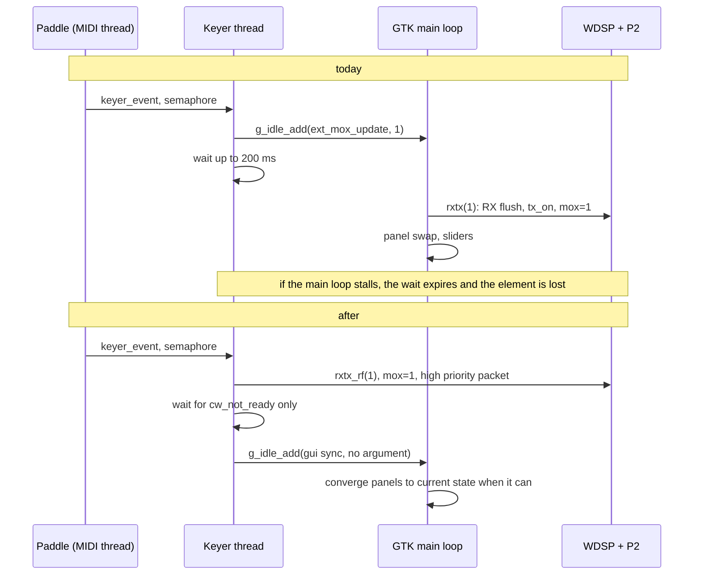
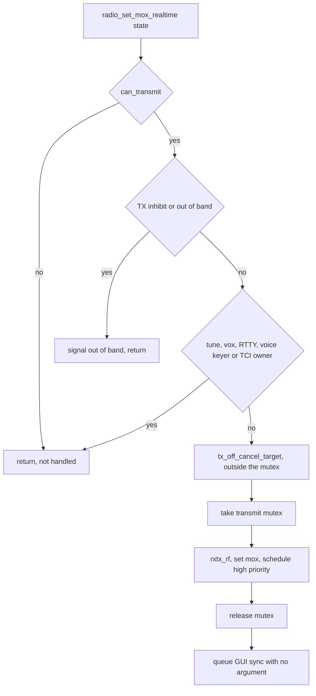

# CW Keying Off The GTK Main Loop - Plan

## Goal Capsule

- **Objective:** every CW element the operator keys in break-in is transmitted. The first element of a transmission is never silent, whatever the user interface is doing at that moment, while no other subsystem owns transmit.
- **Means:** split the transmit switch into a real-time half the keyer thread runs itself and a GUI half the main loop applies later (KTD1), used by CW break-in only.
- **Authority:** product behaviour follows the Requirements; implementation mechanism follows the Key Technical Decisions. Where a unit and a decision disagree, the decision wins.
- **Execution profile:** one C codebase, no test harness for this area. Each unit is a separate commit; U1 and U2 change no behaviour and are verified by the application still running as before.
- **Stop conditions:** stop and report if the refusal path (R6) turns out to fire in normal keying, if any GTK warning appears during the forced-stall test, or if the transmitter can be left keyed after the hang time in any case of the test matrix.
- **Tail ownership:** the implementer removes the diagnostic instrumentation (U6) before declaring the work done.

---

## Product Contract

### Summary

The CW keyer will start and stop transmit on its own thread instead of queueing the request on the GTK main loop. The transmit switch splits into a real-time half (WDSP channels, transmit state, P2 high-priority packet) and a GUI half that converges the interface to the current state whenever the main loop runs. The paddle keyer and the CAT/TCI CW engine use the new path in both directions; every other transmit caller keeps the existing path.

### Problem Frame

The keyer thread does not start transmit itself. It posts `ext_mox_update` with `g_idle_add` (`src/iambic.c:365`) and then waits at most 200 ms for `mox && !cw_not_ready` (`src/iambic.c:374`). `g_idle_add` runs at the lowest main-loop priority, so the request waits behind every timer, redraw and event.

When the main thread does not run for longer than that budget, the keyer stops waiting and keys anyway. `tx_add_mic_sample()` then decrements `cw_key_down` while the radio is still receiving (`src/transmitter.c:2073-2075`), so the element is consumed without RF. The operator sees MOX on screen and hears no first dit.

Measurements from this codebase on an ANAN Orion2, taken with temporary timing lines in `src/iambic.c` and `src/radio.c` over two builds and about 75 keying events: the transmit switch itself costs 21-53 ms, of which 21-46 ms is the WDSP receiver flush. The remainder of the keyer's wait is queue time. On a normal event the total is 23-89 ms. On eight events it exceeded 200 ms, and in the worst case the main loop ran nothing for about 1.9 s, after which three queued transmit requests and their matching releases executed back to back. Both builds behaved the same, so the cause is not recent application changes.

Two cheaper fixes do not cover those measurements. Raising the priority of the queued request addresses queue time only, and the worst case was not queueing but the main loop running nothing at all for about 1.9 s. Holding the element on the existing queued request, without moving the switch, turns a lost first dit into a character delayed by that same 1.9 s, which is too late to be usable, and it leaves the release in the same position.

The keyer thread itself is already independent: it runs its own 1 ms state machine (`src/iambic.c:325`, `src/iambic.c:571-577`), it is woken by the paddle on the MIDI callback thread (`src/actions.c:465`), and element length is counted by the P2 mic thread (`src/transmitter.c:1972-1978`). The transmit switch is the only part of the path that needs the GUI thread.

### Requirements

**Keying path**

- R1. A paddle press starts transmit without waiting for the GTK main loop.
- R2. The release at the end of the hang time also runs without waiting for the GTK main loop.
- R3. When transmit cannot start immediately, the keyer holds the element until the transmitter is ready instead of counting it down during receive. A late but complete character replaces a silent one.
- R4. CAT and TCI generated CW uses the same path, in both directions.

**Transmit policy parity**

- R5. The real-time path enforces the transmit gates the main-loop path enforces: band limits through `TransmitAllowed()` and TX inhibit through `radio_get_tx_inhibit()`.
- R6. The real-time path refuses and falls back to the existing main-loop path when TUNE, VOX, native RTTY, the voice keyer, or a TCI transmit owner is active.
- R7. A pending graceful transmit-off is cancelled before the real-time path keys, and the cancellation cannot deadlock against its own completion callback.

**Interface consistency**

- R8. After the main loop recovers, the interface shows the current transmit state. Transmit requests that queued up during a stall leave no panel flicker, no unbalanced container operation and no discarded receive audio.
- R9. Every GTK call stays on the main loop.

### Key Decisions

- Only CW break-in moves to the real-time path (session-settled: user-approved - chosen over converting every transmit caller: the speech-tail machinery in `src/tx_off.c` and the PTT, VOX and TUNE paths keep their current behaviour). Governs R1, R2, R4, R6.
- A held element replaces a dropped one when the transmitter is not ready (session-settled: user-approved - chosen over today's silent drop: a late character is readable, a truncated one is not). Governs R3.
- Both transmit directions move, not only receive-to-transmit (session-settled: user-approved - chosen over converting the start only: a stalled release leaves the transmitter keyed, which is worse than a late start). Governs R2.
- Why the interface stalls is not investigated here (session-settled: user-directed - chosen over hunting the cause first: keying must not depend on the interface thread whatever the cause).
- The fork carries the split transmit switch as a deliberate divergence from upstream. `src/radio.c` is almost entirely upstream-authored and recent upstream work landed inside the function being split, so every merge that touches it costs a manual re-classification of each new statement into the real-time or the interface half. A wrong call there puts a GTK call on the keyer thread, which is what R9 exists to prevent, so that re-check belongs in the upstream-merge routine, and the classification table in the Planning Contract is updated in the same pass. Governs R9.

### Success Criteria

- 40 single dits, each starting from receive, produce 40 transmitted dits, and the permanent fallback log line (KTD12) appears zero times.
- With a forced 1.5 s main-loop freeze running during keying, the transmitted elements stay correct and the log shows no GTK warning.
- Two latency measurements on the same interval as the 23-89 ms baseline: total request-to-ready stays within the transmit switch's own measured cost of 21-53 ms with no sample above 100 ms, and the readiness handshake after the RF half stays under 5 ms. The gain is the removal of queue time, not a faster switch.

### Scope Boundaries

- The MOX button, hardware PTT, serial PTT, VOX, TUNE, CAT MOX commands and TCI MOX commands keep the existing main-loop path.
- The voice keyer and the native RTTY engine keep their current transmit handling.
- While TUNE, VOX, native RTTY, the voice keyer or a TCI client owns transmit, CW keying stays on the main-loop path and a first element can still be lost, as it can today. R6 makes that explicit; the Objective is scoped to match.
- The cause of the main-loop stalls is not in scope.

#### Deferred to Follow-Up Work

- `src/tci.c:2621` calls `ext_mox_update()` inline from the TCI websocket service thread, which already reaches GTK calls in `rxtx()` from a non-GUI thread. This predates the work here. The mutex added in U3 serialises it against the keyer, which removes the state race but not the GTK access.
- `pre_mox` (`src/radio.c:424`) has no reader anywhere in `src/`. Its documented purpose, suppressing audio to the radio during receiver shutdown, is not implemented. Either wire it up or delete it, separately from this work.
- Offering the change upstream to the deskHPSDR project, once the work has run on the air for a while without a fallback line in the log. Upstream ownership of the transmit switch is what would retire the per-merge re-classification cost recorded in the Key Decisions.

---

## Planning Contract

### Key Technical Decisions

- KTD1. **Split `rxtx()` into an RF half and a GUI half.** The RF half (`rxtx_rf`) performs WDSP channel changes, transmitter on and off, PureSignal, the `pre_mox` flag, the feedback and receiver sample resets, and is callable from any thread. The GUI half performs panel moves, `displaying` flags, transmit level windows, slider state, `tci_mox_changed()` and the VFO update. Rationale: only the RF half has a deadline.
- KTD2. **The GUI half takes no state argument.** It compares a file-static `gui_tx_shown` against `radio_is_transmitting()` when it runs and returns early when they match. A queued pair of transmit and receive updates left over from a stall then collapses to a no-op, which is what R8 requires. A `state` argument would replay a stale panel removal and a stale `gtk_fixed_put`, which double-parents the panel and discards receive audio collected after the real transition.
- KTD2a. **The notifications do not live in the converger.** `update_slider_mic_gain_btn()` and `tci_mox_changed()` run today outside the transition guard, on every call of `radio_set_mox_now()` (`src/radio.c:2207-2210`), and `tci_mox_changed()` is further gated on the tune state captured before `radio_set_tune(0)` clears it (`src/radio.c:2183`). A converger that returns early when the state already matches would skip both. They go into a separate, unconditional notification step that each entry point queues with the state it applied.
- KTD3. **Every caller of the transmit switch uses the same two halves.** `rxtx()` has five call sites: `radio_set_mox_now()` (`src/radio.c:2202`), `radio_set_vox()` (`src/radio.c:2281`) and three in `radio_set_tune()` (`src/radio.c:2298`, `:2415`, `:2418`). All of them call the RF half and then queue the converger, so `gui_tx_shown` has one owner and the paths cannot drift. Leaving tune or VOX on the old inline path would desynchronise that flag and make the next converger run replay or skip a panel operation.
- KTD4. **The real-time entry point is built on the contract of `radio_mox_update()`, not of `radio_set_mox_now()`.** `TransmitAllowed()` lives in `radio_mox_update()` (`src/radio.c:2143-2147`), one layer above `radio_set_mox_now()`. Building on the lower layer would key the PA outside the band edge, because today the keyer's 200 ms timeout is what silently rejects an out-of-band paddle press (`src/iambic.c:371-374`). Governs R5.
- KTD5. **Refuse and fall back instead of reimplementing cancellation off-thread.** `radio_set_tune(0)` does slider updates and a 50 ms sleep (`src/radio.c:2325-2365`), `vox_cancel()` removes main-loop sources (`src/vox.c:180`), the RTTY abort and the voice-keyer takeover live above `radio_set_mox_now()` (`src/radio.c:2236-2238`, `src/ext.c:108-110`), and TCI transmit ownership is held in `tci_tx_owner` / `tci_tx_owner_mode` (`src/tci.c:292-301`). When any of those subsystems owns transmit, the real-time path returns without keying and the caller uses the existing `g_idle_add` path. These collisions are rare and are not latency critical. Governs R6.
- KTD6. **Cancel a pending graceful transmit-off before taking the new mutex.** `tx_off_cancel_target()` waits on a condition variable while the completion callback runs (`src/tx_off.c:239-249`), and that callback reaches `radio_set_mox_now()`, which will take the new mutex. Calling it inside the mutex gives the keyer thread and the main loop an AB/BA deadlock. Governs R7.
- KTD7. **Keep `tci_mox_changed()` in the GUI half.** It walks the client list and sends to each client under `tci_mutex` (`src/tci.c:1825-1838`), and `src/rtty_engine.c:80-82` documents the existing order `rtty_mutex -> radio_set_mox() -> tci_mutex`. Leaving it on the main loop keeps the new mutex out of that chain and keeps unbounded per-client work off the keyer thread.
- KTD8. **The RF half does not take `rx->display_mutex`.** `GetPixels()` reads the display object `pdisp[]` under its own critical sections (`wdsp-2.10/analyzer.c:1323-1335`) and does not touch the channel state that `SetChannelState()` changes. A display timer that fires between the RF half and the GUI half renders one stale frame. Taking the display lock in the RF half would add a lock to the keying path for a cosmetic symptom.
- KTD9. **`tx_on()` and `tx_off()` lose their GTK calls.** Both call `tx_levels_show()` / `tx_levels_hide()`, which create and destroy a dialog (`src/transmitter.c:2423-2455`). They have exactly two callers, both inside `rxtx()` (`src/radio.c:2046`, `src/radio.c:2075`), so the calls move to the GUI half. Governs R9.
- KTD10. **Promote `cw_not_ready`, `cw_key_down` and `cw_key_up` to `_Atomic int`** (`src/transmitter.c:83-85`). Three threads already touch them with no synchronisation. This change makes the `cw_not_ready` handshake the load-bearing readiness signal, so it gets the same treatment `mox`, `vox` and `tune` already have (`src/radio.c:427-428`, `src/radio.c:467`).
- KTD11. **Verify with a deliberate main-loop freeze** (session-settled: user-approved - chosen over waiting for a natural stall during on-air keying: a natural stall is not reproducible, and the change is precisely about surviving one).
- KTD12. **One log line survives the cleanup.** The fallback to the main-loop path and an element held waiting for readiness each log a permanent, rate-limited line. Today the only marker of a lost element comes from the temporary timing line in the keyer, which this work removes, so after the cleanup nothing would report a silent fallback in the field. This line is excluded from the instrumentation the Definition of Done deletes. Governs R3, R6.

### High-Level Technical Design

Paddle press today and after the change. The difference is who performs the RF work and when the interface catches up.

Gate order inside the real-time entry point. Each refusal returns without keying, and the caller falls back to the existing path.

### Implementation Constraints

Every statement in `rxtx()` and `radio_set_mox_now()` belongs to exactly one half. The table is the classification the units implement. Line numbers are against the working tree with the temporary `DIAG` timing lines still in `src/iambic.c` and `src/radio.c`; removing them shifts the `src/radio.c` numbers up by about nine.

| Work | Site | Half |
|---|---|---|
| Capture, transmit and replay abort | `src/radio.c:1986-2000` | RF, at the start of the transmit direction. It is a one-shot side effect, not state convergence, so the converger would drop it whenever a short element collapses the pair. `schedule_action()` already queues its follow-up to the main loop |
| `pre_mox` | `src/radio.c:2002` | RF, set first |
| Feedback receiver sample resets | `src/radio.c:2010-2011` | RF |
| Receiver flush, `rx_begin_off` and `rx_wait_off` | `src/radio.c:2015-2020` | RF |
| Panel move, `displaying`, `rx_set_displaying` on the transmit side | `src/radio.c:2021-2033` | GUI |
| Transmit dialog and panel | `src/radio.c:2035-2042` | GUI |
| PureSignal, `tx_ps_mox` | `src/radio.c:2043-2045` | RF |
| `tx_on` / `tx_off` channel state | `src/radio.c:2046`, `src/radio.c:2075` | RF |
| Transmit level window | inside `tx_on` / `tx_off` today | GUI, after KTD9 |
| `transmitter->displaying`, `tx_set_displaying` | `src/radio.c:2047-2048`, `src/radio.c:2076-2077` | GUI. It arms and removes a main-loop timer source |
| Transmit dialog hide and panel removal | `src/radio.c:2078-2083` | GUI |
| `do_silence` selection | `src/radio.c:2092-2117` | RF. It only feeds `txrxmax`, and is inert on this radio |
| Receiver panel restore | `src/radio.c:2120` | GUI |
| `audio_reprime_output` | `src/radio.c:2122` | RF |
| `rx_on` | `src/radio.c:2124` | RF |
| `displaying`, `rx_set_displaying` on the receive side | `src/radio.c:2125-2126` | GUI |
| Receiver `samples`, `txrxmax`, `txrxcount` | `src/radio.c:2131-2137` | RF |
| `vox_cancel`, `radio_set_tune(0)` | `src/radio.c:2193-2195` | GUI only, refusal case per KTD5 |
| `mox` assignment | `src/radio.c:2204` | RF |
| `tune = 0`, `vox = 0` | `src/radio.c:2205-2206` | RF, with the `mox` assignment |
| `update_slider_mic_gain_btn` | `src/radio.c:2207` | GUI, unconditional notification step per KTD2a |
| `tci_mox_changed` | `src/radio.c:2209` | GUI, unconditional notification step per KTD2a and KTD7 |
| `schedule_high_priority`, `schedule_receive_specific` | `src/radio.c:2213-2214` | RF |

Threading rules this codebase already follows, which the units must not break:

- GTK is reached only through `g_idle_add`, `g_timeout_add`, `gdk_threads_add_*` or `g_main_context_invoke`. There is no GDK lock in use.
- New locks use `GMutex`. `pthread_mutex_t` appears only in the protocol layer.
- `schedule_high_priority()` and `schedule_receive_specific()` are already called from the P2 timer thread and are guarded by their own mutexes (`src/new_protocol.c:444-455`), so calling them from the keyer thread follows existing practice.
- `update_slider_mic_gain_btn()` in `src/sliders.c:1293-1314` is the closest existing example of an interface update that syncs to current state through `g_main_context_invoke` rather than toggling. U2 follows its shape.

### Risks & Dependencies

- Menu operations on the main thread (`rx_set_mode`, `rx_set_filter`, `rx_change_sample_rate` in `src/receiver.c`) call WDSP on the same channel the RF half stops and starts. WDSP guards its own unit state, and these operations need an operator to be in a menu while keying, so the plan accepts the window instead of extending the mutex over menu code. If it produces a fault in practice, the fix is to take `rx->mutex` in the RF half.
- No automated test covers threading, `src/iambic.c`, `src/cw_engine.c` or `src/radio.c`. `make test` runs only `tci-spectrum-test` and `property-test`, which do not touch this code. Verification is manual and log-based, which is why U6 exists.
- The refusal path (R6) means a first dit can still be lost while TUNE, VOX, RTTY, the voice keyer or a TCI client owns transmit. This is the same behaviour as today and is accepted.

### Sources & Research

- Keyer request and wait: `src/iambic.c:359-374`, release path `src/iambic.c:401-408`.
- Element consumed during receive: `src/transmitter.c:2067-2082`.
- Transmit switch: `rxtx()` at `src/radio.c:1979`, `radio_set_mox_now()` at `src/radio.c:2181`, `radio_mox_update()` at `src/radio.c:2143`.
- Graceful transmit-off machinery and its condition variable: `src/tx_off.c:239-249`.
- CAT and TCI CW engine, one request site and five release sites: `src/cw_engine.c:412`, `:444`, `:466`, `:488`, `:506`, `:536`.
- Measurements from this session: `deskhpsdr.log` and `deskhpsdr.log.1` in the application working directory, lines marked `DIAG`.

---

## Implementation Units

### U1. Take GTK out of the transmitter on and off calls

- **Goal:** `tx_on()` and `tx_off()` change WDSP channel state only.
- **Requirements:** R9
- **Dependencies:** none
- **Files:** `src/transmitter.c`, `src/transmitter.h`, `src/radio.c`
- **Approach:**
  1. Remove the `tx_levels_show()` and `tx_levels_hide()` calls from `tx_on()` and `tx_off()`. Both are `static inline` in `src/transmitter.c` today, so the caller in `src/radio.c` needs them exported through `src/transmitter.h`.
  2. Call them from `rxtx()` at the two existing call sites, where they stay until U2 moves them into the GUI half.
- **Patterns to follow:** the two call sites are the only callers, `src/radio.c:2046` and `src/radio.c:2075`.
- **Test scenarios:**
  - In SSB, MOX on and off with the transmit level window enabled: the window appears and disappears as before.
  - In CW, MOX on: no level window appears, matching the mode test inside `tx_levels_show()`.
  - Tune on and off with the level window enabled: unchanged behaviour.
- **Verification:** the application behaves as before this unit; no functional change is intended.

### U2. Split the transmit switch into an RF half and a GUI converger

- **Goal:** `rxtx()` becomes two functions with the classification in Implementation Constraints, used by all five of its existing call sites, with no new thread calling it yet.
- **Requirements:** R8, R9
- **Dependencies:** U1
- **Files:** `src/radio.c`, `src/radio.h`
- **Approach:**
  1. Add `rxtx_rf(int state)` holding the RF rows of the table, with no GTK call.
  2. Add an argument-less GUI converger holding the GUI rows plus the level window from U1, comparing a file-static `gui_tx_shown` against `radio_is_transmitting()` and returning early when they match (KTD2).
  3. Add the unconditional notification step of KTD2a, carrying the slider update and the tune-gated TCI notification with the state the caller applied.
  4. Route all five `rxtx()` call sites through the RF half plus the converger: `radio_set_mox_now()` (`src/radio.c:2202`), `radio_set_vox()` (`src/radio.c:2281`) and the three in `radio_set_tune()` (`src/radio.c:2298`, `:2415`, `:2418`), per KTD3.
  5. Keep the `duplex` structure of the current function unchanged.
- **Execution note:** this unit is behaviour-preserving. Prove it by exercising the existing paths before adding any new caller.
- **Patterns to follow:** `update_slider_mic_gain_btn()` in `src/sliders.c:1293-1314` for the sync-to-state shape.
- **Test scenarios:**
  - MOX button on and off in SSB: receiver panels leave and return, transmit panel appears, sliders update, as before.
  - Hardware PTT press and release: same result.
  - Tune on and off: transmit panel handling unchanged, and a MOX on and off cycle straight afterwards still moves the panels correctly.
  - VOX triggered by speech, then released: panels move as before.
  - Two rapid MOX on and off cycles: panels end in the correct state, no GTK warning on stderr.
  - MOX off while already receiving, and MOX on while VOX is pending: a TCI client still receives the transmit-state message and the microphone-gain control still updates, both cases where no switch happens.
  - Receiver 2 enabled: both receiver panels are removed and restored.
- **Verification:** all transmit entry points behave as before, and the converger runs at least once per transition, confirmed by a temporary log line.

### U3. Add the transmit mutex and the real-time entry point

- **Goal:** any thread can perform a transmit transition, with the same policy gates the main-loop path applies.
- **Requirements:** R5, R6, R7
- **Dependencies:** U2
- **Files:** `src/radio.c`, `src/radio.h`, `src/tci.c`, `src/tci.h`, `src/voice_keyer.c`, `src/voice_keyer.h`
- **Approach:**
  1. Add a `GMutex` that serialises transitions. `radio_set_mox_now()` takes it as well, so main-loop and keyer transitions cannot interleave.
  2. Add `radio_set_mox_realtime()` with three outcomes, in the gate order of the flowchart: transmit capability, TX inhibit and `TransmitAllowed()`, refusal conditions, `tx_off_cancel_target()` before the mutex, then mutex, `rxtx_rf()`, `mox`, the two protocol schedules, release, then queue the GUI converger. The outcomes are: keyed; refused, use the main-loop path; refused, nothing will key. The third covers out of band and TX inhibit, where falling back would only repeat the refusal.
  3. Return the previous transmit state, read inside the mutex, through a separate output rather than the result, so a refusal and a previous state of receive cannot be confused. The caller then does not read `mox` separately before the transition.
  3a. Take the mutex with a bounded acquisition, not a plain blocking one, and return "refused, use the main-loop path" when it cannot be taken. The main-loop path holds the same mutex across the whole transmit switch, so a stall that begins inside a transition would otherwise block the keyer for its full duration, which is the failure this work removes (R1).
  4. On out-of-band, signal it the way `radio_mox_update()` does, from the main loop.
  5. Document the lock order against `rtty_mutex` and `tci_mutex` in a comment at the mutex definition (KTD7).
  6. Export the two refusal predicates the gate needs and cannot see today: TCI transmit ownership over `tci_tx_owner` / `tci_tx_owner_mode` (`src/tci.c:292-301`), and voice-keyer playback over its existing play state. Both must be readable without taking `tci_mutex`. The remaining three conditions, tune, VOX and the RTTY flag, are already visible from `src/radio.c`.
- **Test scenarios:**
  - Out of band with the paddle: the entry point refuses, nothing keys, and the out-of-band indication appears.
  - TX inhibit asserted: refuses, nothing keys.
  - TUNE active, then a transmit request through the real-time entry point: refuses and reports not handled.
  - VOX active: same.
  - A TCI client owns transmit: same.
  - A graceful transmit-off is draining, then a real-time request arrives: the drain is cancelled, transmit continues, no deadlock, and the completion callback does not fire afterwards.
  - Two threads requesting opposite states at the same time: the mutex serialises them and the final state matches the last request.
  - The mutex is held by another thread for longer than the bound: the entry point returns "use the main-loop path" instead of blocking, and the caller's fallback keys through the old route.
  - Out of band and TX inhibit both return "nothing will key", distinct from the refusals that tell the caller to use the main-loop path.
- **Verification:** each refusal case leaves `mox` unchanged, and the accepted case reaches transmit with the interface converging afterwards.

### U4. Move the paddle keyer onto the real-time path

- **Goal:** the keyer starts and stops transmit itself and holds an element until the transmitter is ready.
- **Requirements:** R1, R2, R3
- **Dependencies:** U3
- **Files:** `src/iambic.c`, `src/transmitter.c`, `src/transmitter.h`
- **Approach:**
  1. Replace the request at `src/iambic.c:365` with `radio_set_mox_realtime(1)`, and fall back to the existing `g_idle_add` request when it reports not handled.
  2. Replace the release at `src/iambic.c:401` the same way.
  3. Reduce the waits to the `cw_not_ready` handshake, which the P2 mic thread clears within about 1.3 ms. Keep a bounded timeout for the fallback case, and do not start counting the element down before the handshake completes (R3).
  3a. Log the permanent line of KTD12 whenever the real-time path is refused or the handshake wait expires, in both this unit and U5.
  4. Read the previous transmit state through U3's output instead of the unlocked read at `src/iambic.c:359`.
  5. On "nothing will key", and when the fallback path's bounded wait also expires, abandon the pending element: clear `cw_key_down` and `cw_key_up` in the keyer and return to the idle state, so no stale element is emitted at the next transmission and the drain at `src/transmitter.c:2075` never consumes a held one.
  6. Promote `cw_not_ready`, `cw_key_down` and `cw_key_up` to `_Atomic int` (KTD10).
- **Test scenarios:**
  - Single dit from receive, repeated 40 times more than 0.5 s apart: 40 transmitted dits, no silent first element.
  - Continuous keying through the hang time: element and space lengths unchanged at 22 and 30 wpm.
  - Paddle held down in straight-key mode: transmit starts and stays until release.
  - Paddle pressed while the footswitch is already held: the keyer does not release transmit at the end of the hang time.
  - Paddle pressed out of band: nothing keys, no stuck state, and the next in-band press works.
  - Paddle pressed during an active CAT CW transmission: the CAT transmission aborts as it does today.
- **Verification:** the permanent fallback line never appears during the 40-dit run, and both latency measurements of the third Success Criterion are inside their bounds.

### U5. Move the CAT and TCI CW engine onto the real-time path

- **Goal:** machine-generated CW gets the same treatment in both directions.
- **Requirements:** R4
- **Dependencies:** U3
- **Files:** `src/cw_engine.c`
- **Approach:**
  1. Convert the request site and all five release sites (`:412`, `:444`, `:466`, `:488`, `:506`, `:536`), with the same fallback as U4.
  2. Re-check the 500 ms release wait at `src/cw_engine.c:493`, which becomes unnecessary once the release is synchronous.
- **Execution note:** converting the request without the releases leaves the transmitter keyed during a stall, which is worse than today. Treat the six sites as one change.
- **Test scenarios:**
  - A CAT CW message of several words: correct characters, transmit released at the end.
  - A TCI CW macro: same.
  - A CAT CW message interrupted by the paddle: the message aborts and the paddle takes over.
  - A CAT CW message while out of band: nothing keys.
  - A CAT CW message with the voice keyer playing: the engine falls back to the existing path and behaves as today.
- **Verification:** no case leaves the transmitter keyed after the last character.

### U6. Verification instrumentation

- **Goal:** prove independence from the main loop instead of waiting for a natural stall.
- **Requirements:** R1, R8
- **Dependencies:** none for the main-loop freeze; U3 for the real-time refusal counter
- **Files:** `src/radio.c`, `src/iambic.c`
- **Approach:**
  1. Add a main-loop freeze behind an environment variable: a timer that blocks the main thread for a configurable interval, off by default.
  2. Keep the existing `DIAG` timing lines during bring-up and add a counter for real-time refusals, so the fallback rate is visible.
  3. The freeze harness and the `DIAG` timing lines are removed before the work is declared done. The permanent fallback line of KTD12 stays in the shipped build.
- **Execution note:** this unit may land first, since U4 and U5 cannot be proven without it.
- **Test scenarios:**
  - With a 1.5 s freeze every 10 s and continuous keying: elements stay correct, no GTK warning, panels converge after each freeze.
  - A freeze that starts while the main loop is inside a transmit transition, so it holds the transmit mutex: the keyer's bounded acquisition expires, the fallback keys through the main-loop path, and the permanent fallback line records it.
  - With the freeze off: no measurable change against the build without the instrumentation.
- **Verification:** the freeze visibly stops the panadapter while keying continues correctly.

---

## Verification Contract

| Check | Command or action | Applies to |
|---|---|---|
| Build | `make -j8 deskhpsdr` in the worktree, with a `wdsp-libs` symlink present. Never bare `make`: the default goal runs `update_libs.sh`, which upgrades every Homebrew package on the machine | U1-U6 |
| Static analysis | `make cppcheck`, no new finding in the touched files | U1-U6 |
| Existing tests | `make test`, which runs `tci-spectrum-test` and `property-test`, must stay green | U1-U6 |
| Keying matrix | The test scenarios of U4 and U5 on the Orion2 | U4, U5 |
| Stall independence | U6 freeze active while keying | U4, U5 |
| Log review | `deskhpsdr.log` in the application working directory: no permanent fallback or held-element line during normal keying, no GTK warning, refusal counter at zero | U4, U5 |

---

## Definition of Done

- R1 to R9 hold on the Orion2.
- 40 single dits produce 40 transmitted dits, with and without the forced freeze.
- No case in the U3, U4 and U5 scenarios leaves the transmitter keyed or leaves the keyer believing it transmits while the radio receives.
- The interface converges to the correct state after every freeze, with no GTK warning.
- Per unit: U1 and U2 change no observable behaviour; U3 refuses every out-of-band, TX-inhibit, TUNE, VOX, RTTY, voice-keyer and TCI-owner case, and completes the transition without refusal or deadlock in the graceful transmit-off and concurrent-request cases; U4 and U5 report no refusal during normal keying.
- The U6 freeze harness and the `DIAG` timing lines are removed, the permanent fallback line of KTD12 remains, and no experimental code from abandoned attempts remains in the diff.
- `make cppcheck` and `make test` are clean.
